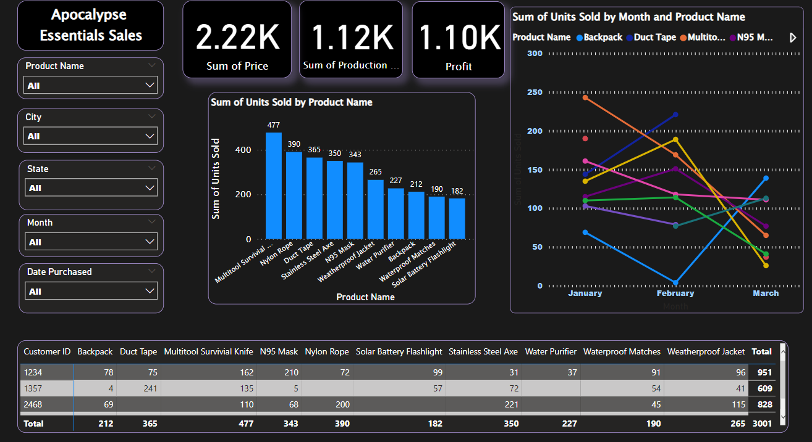

# Apocalypse-Sales-Power-BI-Dashboard
🔍 The Apocalypse Essentials dataset is a comprehensive collection of crucial items needed to survive and thrive during extreme situations, from natural disasters to post-apocalyptic scenarios. 🌪️🔥💧🧟‍♂️.      

📋 Key features of the Dashboard:       
1️⃣ Essential Supplies: Discover a detailed list of must-have survival supplies, including food, water, medical kits, tools, and more.        
2️⃣ Trends Analysis: Increment and decrement in number of units sold per product over the period of three months from January to March.         
3️⃣ Real-Time Updates: With live data feeds, stay informed about the latest availability of essentials.         
4️⃣ Tabular Description: Count of units sold to various customer ID.         
